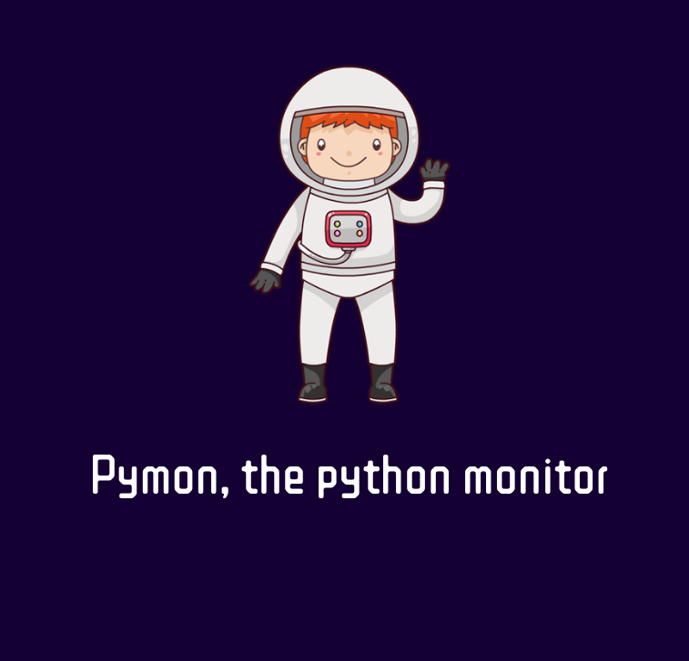
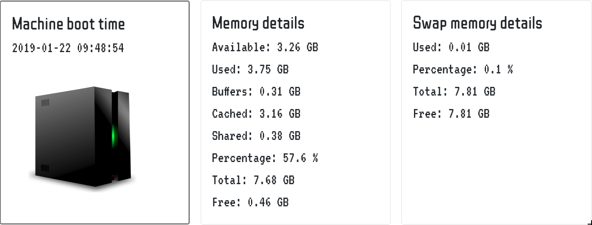
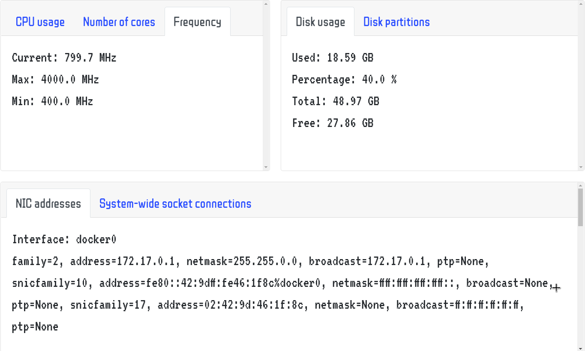
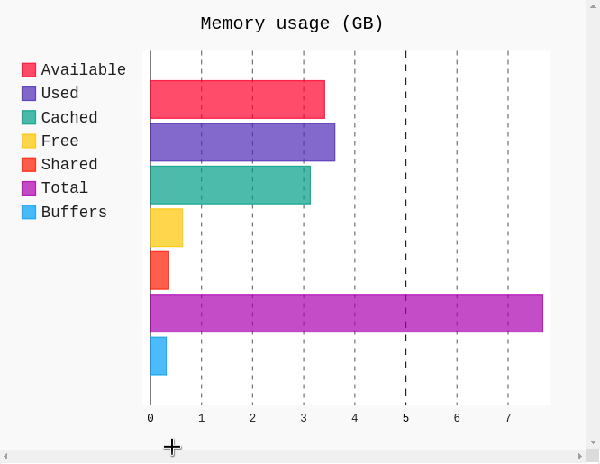
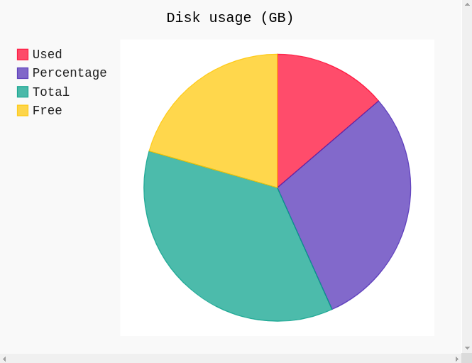

# Pymon, the python monitor
A simple tool built using Python/Flask to serve the purpose of monitoring the health of a personal computer or a server. 
The tool is still under development, but the basic tasks are completed. 

[Screenshots](#Screenshots)

[Installation](#Installation)

[Pymon in a Docker container](#Pymon in a Docker container)

## Screenshots
<p align="center">

</p>

<p align="center">

</p>

<p align="center">

</p>

<p align="center">

</p>

<p align="center">

</p>

## Installation
1. RHEL/Centos/Fedora based distributions:

   First, Python must be installed (skip this step if you have it installed already):
  
   `sudo dnf install python -y`
   
   Next, clone this project into your desired directory and open it:
   
   `git clone https://github.com/RatebSwais/Pymon.git && cd <your path>/Pymon`
 
   Now, to install Flask, the web framework used for this project:
   
   Install python's virtual environment:
   ```
   pip install virtualenv
   
   sudo dnf install virtualenv -y
   ```
   Create the virtual environment inside the project folder and activate it 
   ```
   python3 -m venv venv
      
   . venv/bin/activate
   ```
   
   Now, install Flask, psutil and pygal (modules needed to run the app):
   
   ```
   pip install Flask
   
   pip install psutil
   
   pip install pygal
   ```
   
   
   It's time to start our app:
   
   Tell flask the app file to use then run flask using:
   ```
   export FLASK_APP=app.py
   
   flask run
   ```
## Pymon in a Docker container
   If you wish to skip the above and use a pre-cooked Docker container, run the docker command below as root:
   
   `docker run -d -p 5000:5000 rain40/pymon:latest`
   
   If you do not have docker installed, you need to install it first:
   
   `sudo dnf install docker -y`
   
   
   
   
   
